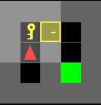

# Reinforcement Learning su MiniGrid: Q-Learning vs SARSA

Questo repository contiene l'implementazione e il confronto tra gli algoritmi di Reinforcement Learning **Q-Learning Tabulare** e **SARSA**, testati all'interno dell'ambiente `DoorKey` di **MiniGrid**.

L'obiettivo dell'agente è apprendere come muoversi in una griglia, raccogliere una chiave, aprire una porta e raggiungere l'obiettivo finale nel minor numero di passi possibile.

  
  
<i>Visualizzazione dell'ambiente DoorKey in MiniGrid</i>

## Obiettivi del Progetto

Il progetto analizza come diverse strategie di aggiornamento della funzione valore e diversi metodi di esplorazione influenzino le performance dell'agente in un ambiente a stati discreti.

In particolare, sono state messe a confronto:
* **Algoritmi:** Q-Learning (Off-Policy) vs SARSA (On-Policy).
* **Strategie di Esplorazione:**
    * `Epsilon-Greedy`: bilanciamento fisso/decadente tra esplorazione e sfruttamento.
    * `Softmax (Boltzmann)`: selezione probabilistica basata sui valori Q correnti.

## Analisi dei Risultati
Dopo la fase di addestramento, i risultati sono stati confrontati per determinare la combinazione più efficace in termini di:
1. **Velocità di convergenza**: quanti episodi sono necessari per trovare la policy ottima.
2. **Stabilità**: quanto la policy rimane solida una volta appresa.
3. **Reward cumulativo**: il punteggio medio ottenuto durante il test.
